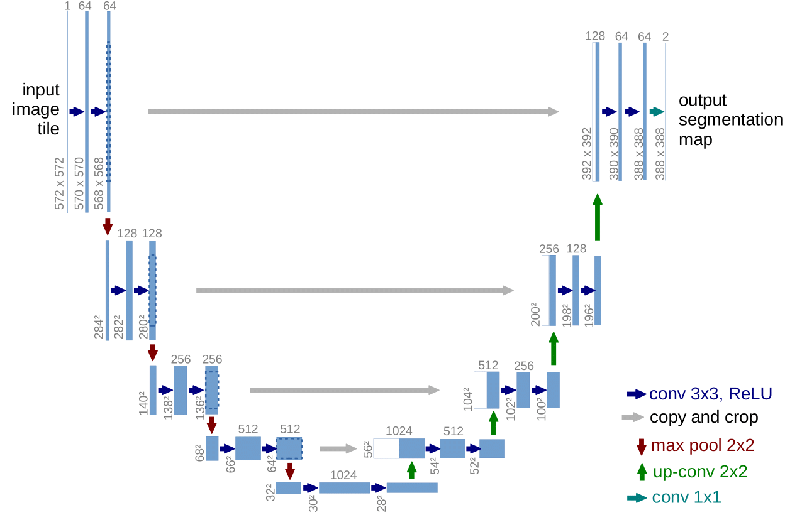

# PyTorch implementation of a U-Net
This project consists of an implementation of a U-Net using PyTorch. The resulting model can be trained or used both for binary segmentation and multi-class segmentation.

## Table of contents
* [The U-Net architecture](#the-u-net-architecture)
* [Dependencies](#dependencies)
* [Installation](#installation)
* [Testing](#testing)


## The U-Net architecture
The U-Net architecture has a unique structure that makes it particularly effective for tasks high resolution inputs and outputs, like image segmentation, super resolution (up-scaling low resolution to high resolution images), or diffusion models (transforming gaussian noise to newly generated images). The model consist of two main parts: an encoder (contracting) path and a decoder (expanding) path, which are connected through a bottleneck and skip connections.

- Each layer of the encoder consists of two 3x3 convolutions, each followed by ReLU activation functions and a downsampling 2x2 max-pooling operators
- Each stage of the decoder consists of upsampling operators (transposed 2z2 convolution), followed by two 3x3 convolutions with ReLU activation functions
- The encoder and decoder are symmetrical and each stage of the encoder is connected with so-called *skip connections* to the corresponding decoder's. Each skip connection takes a copy of the features from the encoder and concatenate it onto its opposing stage in the decoder, meaning that subsequent convolutional layers can operate over both the decoder's and the encoder's feature. The intuition is that the decoded features might contain more semantic information (i.e: *in this region there is object*), whereas the encoded features contain more spatial information (i.e: *these are the pixels where the object is*). Combining both the encoder's and the encoder's feature together, one can in theory achieve pixel-perfect segmentations.
- Finally, the bottleneck is the phase where the decoder "switches" into the decoder: the features are downsampled with a 2x2 max pooling, then they are passed through a 3x3 convolutional layer with ReLU activation function and then they are upsampled again by a 2x2 transposed convolution.

For a better understanding of the theory behind the U-Net model, see the image below or refer to the [original paper](https://arxiv.org/abs/1505.04597).

<p align="center">
  
</p>

## Dependencies
This U-Net is tested and and working against python `3.8`, `3.9`, `3.10` and `3.11`.
The required packages to make this repository work are:
- `torch`
- `torchvision`
- `tqdm`

In order to run the tests, the following two packages are also needed:
- `pytest`
- `hypothesis`

In the file `train_example.py`, the package `albumentation` is also used.

## Installation

(Optional but recommended) Create a python conda environment and activate it:
```
conda create -n unet python
```
```
conda activate unet
```

Clone the repository:
```
git clone https://github.com/puccj/U-Net
```

Install the requirements:
```
pip install -r requirements.txt
```

## Testing
A Testing routine is implemented, by using the `pytest` and `hypothesis` libraries. The test files are inside the `testing` directory. It is possible to run all the tests with:
```
pytest testing/
```


